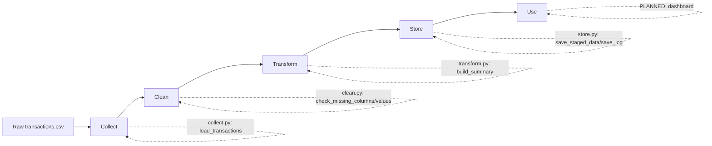

# SA Bank Pipeline — Fraud Detection Data Pipeline

## 1. What this project is

This project takes raw, messy bank transaction data and turns it into something trustworthy and useful — specifically, a system that can flag fraudulent transactions.

It follows five stages, in plain English:

**Collect** the raw transactions → **Clean** them (catch errors) → **Transform** them (calculate useful summaries) → **Store** them properly → **Use** them (a dashboard or report someone can actually look at).

This README describes the **full intended project**, not just what's built so far.

Sections marked `[BUILT]` already exist in the repo. Sections marked `[PLANNED]` are the next steps.

---

## 2. The problem this solves

Banks process huge volumes of transactions every day, and a small fraction of them are fraudulent.

Manually checking each transaction is impossible. A pipeline like this automatically ingests transaction data, checks it for problems, and produces fraud statistics and a clean dataset that a fraud team — or a machine learning model — can actually work with.

---

## 3. Data flow — the big picture



| Stage | What happens | File responsible | Status |
|---|---|---|---|
| Collect | Read the raw CSV without changing it | `src/collect.py` → `load_transactions()` | `[BUILT]` |
| Clean | Check for missing columns and missing values | `src/clean.py` → `check_missing_columns()`, `check_missing_values()` | `[BUILT — flags only, doesn't fix yet]` |
| Transform | Calculate fraud rate, totals, category/month breakdown | `src/transform.py` → `build_summary()` | `[BUILT]` |
| Store | Save clean data and a log | `src/store.py` → `save_staged_data()`, `save_log()` | `[BUILT locally]` `[PLANNED: PostgreSQL / Azure]` |
| Use | Dashboard or report someone can view | — | `[PLANNED]` |

---

## 4. Project structure — full intended layout

```text
banking-pipeline/
│
├── README.md                    ← you are here
├── ARCHITECTURE.md              ← module diagram + how files relate
├── requirements.txt
├── pytest.ini                   ← lets pytest find src/ modules [BUILT]
├── .gitignore
│
├── data/
│   ├── raw/                     ← untouched source files [BUILT]
│   ├── staging/                 ← cleaned/validated output [BUILT]
│   └── processed/               ← final, ready-to-use data [PLANNED]
│
├── src/
│   ├── config.py                ← shared settings (file paths, etc.) [BUILT]
│   ├── collect.py               ← Collect stage [BUILT]
│   ├── clean.py                 ← Clean stage [BUILT]
│   ├── transform.py             ← Transform stage [BUILT]
│   └── store.py                 ← Store stage (local CSV + log) [BUILT]
│
│       PostgreSQL/Azure load    ← [PLANNED]
│
├── tests/
│   ├── conftest.py              ← shared sample-data fixtures [BUILT]
│   ├── test_collect.py          ← automated checks on Collect [BUILT]
│   ├── test_clean.py            ← automated checks on Clean [BUILT]
│   └── test_transform.py        ← automated checks on Transform [BUILT]
│
├── orchestration/
│   └── pipeline_schedule.py     ← runs everything automatically [PLANNED]
│
├── dashboards/
│   └── fraud_dashboard.pbix     ← Power BI file (the "Use" stage) [PLANNED]
│
└── docs/
    └── wiki/                    ← glossary, FAQ, decisions log [PLANNED]
```

### Why split one file into many?

The pipeline used to be one file (`ingest.py`) doing Collect, Clean, and Transform all at once.

It is now split into:

- `collect.py`
- `clean.py`
- `transform.py`
- `store.py`

Shared settings are kept in `config.py`.

This makes the pipeline easier to understand and maintain. If **Clean** breaks, **Collect** can still work, and you know exactly where to look.

Each stage can also be tested independently — which is what the `tests/` folder now does.

---

## 5. Tech stack

| Purpose | Tool | Status |
|---|---|---|
| Data manipulation | Python, pandas | `[BUILT]` |
| Storage (current) | Local CSV + JSON log | `[BUILT]` |
| Storage (target) | PostgreSQL or Azure Blob Storage / Azure SQL | `[PLANNED]` |
| Orchestration | Azure Data Factory (or a simple scheduler) | `[PLANNED]` |
| Testing | pytest | `[BUILT]` |
| Dashboard | Power BI | `[PLANNED]` |
| CI — automatically run tests on every change | GitHub Actions | `[PLANNED]` |

---

## 6. How to run it — current state

Install the required packages:

```bash
pip install -r requirements.txt
```

Place `transactions_sample.csv` inside:

```text
data/raw/
```

Then run:

```bash
python src/store.py
```

This produces:

- a staged CSV file
- a JSON log

inside:

```text
data/staging/
```

### Run the tests

```bash
pytest
```

---

## 7. Roadmap

1. `[BUILT]` Ingestion + validation + summary (Phase 1, single-file version)
2. `[BUILT]` Split into separate Collect / Clean / Transform / Store files, with shared config
3. `[BUILT]` Write pytest tests for Collect / Clean / Transform
4. `[PLANNED]` Load staged data into PostgreSQL or Azure SQL
5. `[PLANNED]` Automate the whole run (schedule it instead of running it by hand)
6. `[PLANNED]` Build a Power BI dashboard on top of the stored data
7. `[PLANNED]` Add GitHub Actions so tests run automatically on every push

---

## Documentation

See `ARCHITECTURE.md` for how the files relate to each other.

See `docs/wiki/` for a plain-English glossary of terms used in this project.

---

**Verification Code:** `WTC-JZQR6V3F`