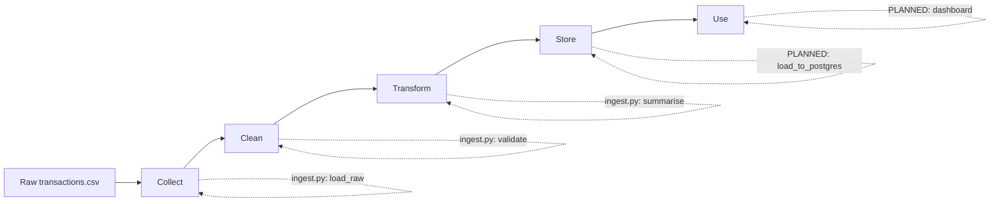

# SA Bank Pipeline — Fraud Detection Data Pipeline

## 1. What this project is

This project takes raw, messy bank transaction data and turns it into something
trustworthy and useful — specifically, a system that can flag fraudulent
transactions. It follows five stages, in plain English:

**Collect** the raw transactions → **Clean** them (catch errors) →
**Transform** them (calculate useful summaries) → **Store** them properly →
**Use** them (a dashboard or report someone can actually look at).

This README describes the **full intended project**, not just what's built so
far. Sections marked `[BUILT]` already exist in the repo. Sections marked
`[PLANNED]` are the next steps.

---

## 2. The problem this solves

Banks process huge volumes of transactions every day, and a small fraction of
them are fraudulent. Manually checking each one is impossible. A pipeline like
this automatically ingests transaction data, checks it for problems, and
produces the fraud statistics and clean dataset a fraud team (or a machine
learning model) can actually work with.

---

## 3. Data flow (the big picture)



| Stage | What happens | File responsible | Status |
|---|---|---|---|
| Collect | Read the raw CSV, don't change anything | `src/ingestion/ingest.py` → `load_raw()` | `[BUILT]` |
| Clean | Check for missing columns, nulls, negative amounts | `src/ingestion/ingest.py` → `validate()` | `[BUILT — flags only, doesn't fix yet]` |
| Transform | Calculate fraud rate, totals, transaction type breakdown | `src/ingestion/ingest.py` → `summarise()` | `[BUILT]` |
| Store | Save clean data + log | `src/ingestion/ingest.py` → `save_staging()` (local file) | `[BUILT locally]` `[PLANNED: PostgreSQL / Azure]` |
| Use | Dashboard or report someone can view | — | `[PLANNED]` |

---

## 4. Project structure (full intended layout)

```
banking-pipeline/
├── README.md                      ← you are here
├── ARCHITECTURE.md                ← module diagram + how files relate
├── requirements.txt
├── .gitignore
│
├── data/
│   ├── raw/                       ← untouched source files          [BUILT]
│   ├── staging/                   ← cleaned/validated output        [BUILT]
│   └── processed/                 ← final, ready-to-use data         [PLANNED]
│
├── src/
│   ├── ingestion/
│   │   └── ingest.py               ← Collect stage                  [BUILT]
│   ├── cleaning/
│   │   └── clean.py                ← Clean stage, split out on its own [PLANNED]
│   ├── transformation/
│   │   └── transform.py            ← Transform stage, split out     [PLANNED]
│   ├── storage/
│   │   └── load_to_db.py           ← Store stage (PostgreSQL/Azure) [PLANNED]
│   └── config.py                   ← shared settings (file paths, etc.) [PLANNED]
│
├── tests/
│   ├── test_ingestion.py           ← automated checks on Collect     [PLANNED]
│   ├── test_cleaning.py            ← automated checks on Clean       [PLANNED]
│   └── test_transformation.py      ← automated checks on Transform   [PLANNED]
│
├── orchestration/
│   └── pipeline_schedule.py        ← runs everything automatically  [PLANNED]
│
├── dashboards/
│   └── fraud_dashboard.pbix        ← Power BI file (the "Use" stage) [PLANNED]
│
└── docs/
    └── wiki/                       ← glossary, FAQ, decisions log    [PLANNED]
```

**Why split one file into many?** Right now `ingest.py` does Collect, Clean,
and Transform all at once. Splitting them means if "Clean" breaks, "Collect"
still works, and you know exactly where to look. Each file also becomes
independently testable.

---

## 5. Tech stack

| Purpose | Tool | Status |
|---|---|---|
| Data manipulation | Python, pandas | `[BUILT]` |
| Storage (current) | Local CSV + JSON log | `[BUILT]` |
| Storage (target) | PostgreSQL or Azure Blob Storage / Azure SQL | `[PLANNED]` |
| Orchestration | Azure Data Factory (or a simple scheduler) | `[PLANNED]` |
| Testing | pytest | `[PLANNED]` |
| Dashboard | Power BI | `[PLANNED]` |
| CI (auto-run tests on every change) | GitHub Actions | `[PLANNED]` |

---

## 6. How to run it (current state)

```bash
pip install -r requirements.txt
# place transactions.csv in data/raw/
python src/ingestion/ingest.py
```

Output: a staged CSV and a JSON log in `data/staging/`.

---

## 7. Roadmap

1. `[BUILT]` Ingestion + validation + summary (Phase 1)
2. `[PLANNED]` Split `ingest.py` into separate Collect / Clean / Transform files
3. `[PLANNED]` Write pytest tests for each stage
4. `[PLANNED]` Load staged data into PostgreSQL or Azure SQL
5. `[PLANNED]` Automate the whole run (schedule it, don't run it by hand)
6. `[PLANNED]` Build a Power BI dashboard on top of the stored data
7. `[PLANNED]` Add GitHub Actions so tests run automatically on every push

See `ARCHITECTURE.md` for how the files relate to each other, and
`docs/wiki/` for a plain-English glossary of terms used in this project.